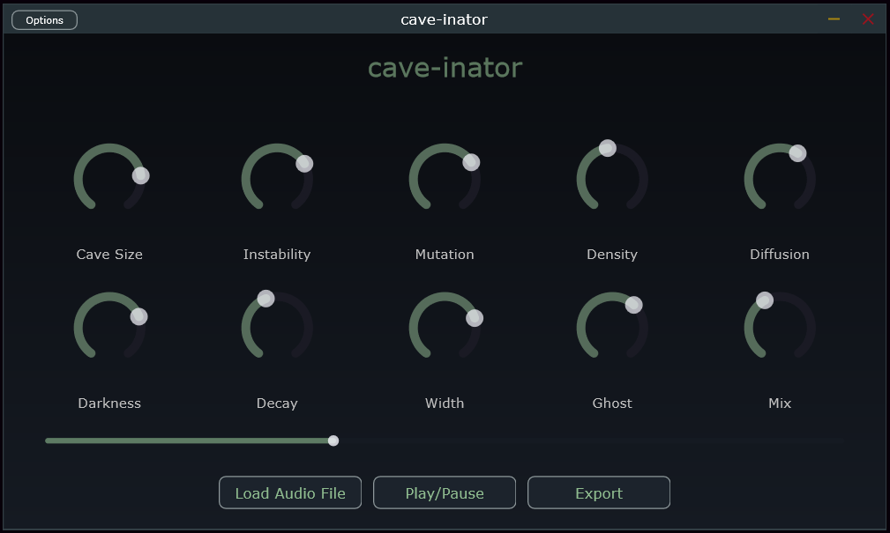

# cave-inator 🦇



**cave-inator** is an experimental standalone audio application built with JUCE that applies a haunting, unpredictable "Eerie Cave" delay and reverb effect to your audio files. Instead of a traditional rhythmic delay, it utilizes a multi-tap delay engine with probabilistic pitch mutations, deep sub-octave shifts, and a massive algorithmic reverb tail to place your sound deep within a terrifying, echoing cavern.

## Download

> **[⬇️ Download the latest release (cave-inator.exe)](https://github.com/Naveen489/cave-inator/releases/latest)**

No installation required - just download and run. Requires **Windows 10/11 (64-bit)**.

## Features

- **Integrated Audio Player**: Load `.wav` or `.mp3` files directly into the standalone app and instantly hear them processed.
- **Interactive Scrubbing**: Includes an interactive playback slider to seamlessly scrub and seek through audio files.
- **Offline Audio Export**: A dedicated "Export" button processes the track offline and saves it to a new `.wav` file, automatically appending a 5-second reverb tail so the cave echoes can decay naturally.
- **Probabilistic Pitch Mutation**: Delay echoes randomly shift in pitch, heavily biased towards deep, rumbling sub-octaves, eerie fifths, and dissonant microtones. Rare upward pitch shifts are heavily attenuated to create distant, ghostly whispers.
- **Massive Cave Reverb**: An algorithmic reverb processor smears individual echoes into a lush, dark wash. The original dry audio is also fed into the reverb to ensure the entire sound sits inside the space.
- **Stereo Spatialization**: True mono-to-stereo mapping distributes the echoes naturally across the stereo field based on the "Width" parameter.

## Parameter Guide

The custom eerie UI provides the following controls:

- **Cave Size**: Controls the fundamental delay times and the algorithmic reverb room size. Larger sizes create massively spaced echoes.
- **Instability**: Determines the randomness in timing and how frequently reflections occur.
- **Mutation**: Controls the chance and extremity of harmonic/pitch shifts applied to the echoes.
- **Density**: Adjusts the number of active delay taps (echoes) bouncing around the cave.
- **Diffusion**: Adjusts how quickly the echoes smear into a continuous reverb wash.
- **Darkness**: A low-pass filter that rolls off high frequencies for a muddier, deeper underground tone.
- **Decay**: Controls the feedback amount-how long the echoes continue to bounce.
- **Width**: Adjusts the stereo spread of the reflections.
- **Ghost**: Occasionally spawns a "ghost reflection" pushed far out in time and unpredictably panned.
- **Mix**: Blends between the pure dry original signal and the fully wet cave environment (reverberated original + reverberated echoes).

## How to Use

1. Launch the `cave-inator.exe` standalone application.
2. Click **Load Audio File** in the transport bar to choose your source audio (`.wav`, `.mp3`).
3. Hit **Play/Pause** to start the audio engine. The scrub slider can be used to seek to different parts of the audio.
4. Twist the parameters to design your perfect eerie soundscape.
5. Click **Export** to save your customized processed audio out to a new `.wav` file on your disk!

## Building from Source

This project uses CMake.

1. Clone the repository.
2. Ensure you have the `JUCE` framework and a valid compiler (e.g., MSVC 2022 on Windows).
3. Open a command prompt and navigate to the repository folder:
```bash
cmake -B build
cmake --build build --config Release
```
4. The executable will be generated at: `build/EerieCaveDelay_artefacts/Release/Standalone/cave-inator.exe`
